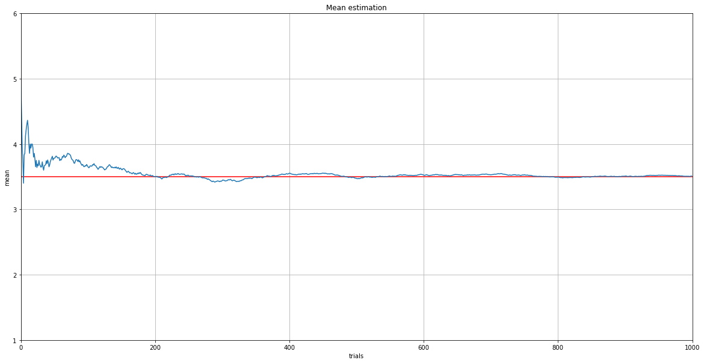

# Law of Large Numbers

## What is the Law of Large Numbers?

The law of large numbers states that if you repeat the same trial a large number of times, the mean of your trial will converge to the mean of the population.

Suppose we have a 6-sided dice and the probability of each number is the same ($1/6$). Then, the mean $\mu$ of the dice is $3.5$.

$$
\mu = 1 \times \frac{1}{6} + 2 \times \frac{1}{6} + 3 \times \frac{1}{6} + 4 \times \frac{1}{6} + 5 \times \frac{1}{6} + 6 \times \frac{1}{6} = 3.5
$$

What the law of large numbers is saying is that we can get it sequentially. The following is a python code that roll a dice in 1000 trials.


```python
import matplotlib.pyplot as plt
import random
from statistics import mean
```


```python
def lawOfLargeNumbers(trial=1000, dice_range=(1, 6)):
    numbers = []
    means = []

    for _ in range(trial):
        numbers.append(random.randint(*dice_range))
        means.append(mean(numbers))

    plt.figure(figsize=(20, 10))
    plt.axhline(mean(dice_range), c='r')
    plt.plot(means)

    plt.xlim(0, trial)
    plt.ylim(*dice_range)
    
    plt.grid()

    plt.title("Mean estimation")
    plt.xlabel("trials")
    plt.ylabel("mean")
    
    plt.show()

lawOfLargeNumbers()
```





The mean converged in $3.5$! But it might be because we have only 6 sides. Let's look at what will happen in a 10,000-sided dice. 


```python
lawOfLargeNumbers(dice_range=(1, 10000))
```


The mean also converged in $5,000$!

## Theorem

For the details: [Wikipedia](https://en.wikipedia.org/wiki/Law_of_large_numbers)

Let $X_1, X_2, ..., X_n$ be a random sample from a population with mean $\mu$ and variance $\sigma^2$. Then, for any $\varepsilon > 0$,

$$
\mathbb{P}(\bar{X} - \mu \geq \varepsilon) \rightarrow 0 \textrm{, as }n \rightarrow \infty
$$
